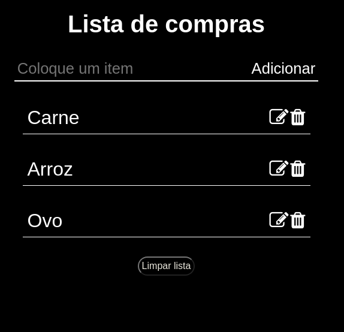

<h1 align="center">
  <a href="https://samucatezu.github.io/groceryBud/">Site do programa :alarm_clock: </a>
</h1>

<h1 align="center" ">
  Home page
</h1>

<h1 align="center" style="display: grid;">
  
</h1>

<h1 align="center" ">
  Lista de compras
</h1>

<h1 style="display: flex" align="center">
  
</h1>

 

## 🚀 Tecnologias
Projeto desenvolvido com as seguintes tecnologias:

- CSS
- HTML5
- JavaScript: appendChild, addEventListener, forEach, JSON.parse, splice, stringify, addEventListener

## 💻 Projeto

Um projeto simples para entender e obter mais conhecimento sobre JavaScript e suas funcionalidades. Nele, o user pode adicionar, editar, deletar e criar itens para criar sua propria lista
